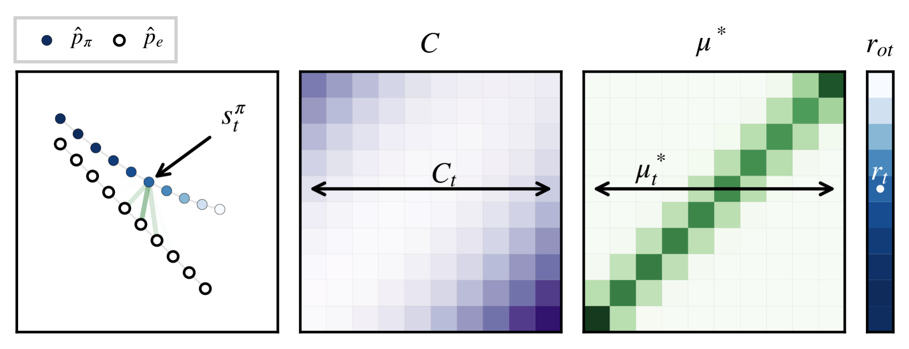

# Official code for Optimal Transport Reward labeling (OTR)



This repository includes the official JAX implementation of [Optimal Transport for Offline Imitation Learning](https://openreview.net/forum?id=MhuFzFsrfvH) 
by [Yicheng Luo](https://luoyicheng.net), [Zhengyao Jiang](https://zhengyaojiang.github.io), [Samuel Cohen](https://twitter.com/CohenSamuel13), [Edward Grefenstette](https://www.egrefen.com), [Marc Peter Deisenroth](https://www.deisenroth.cc).

If you find this repository useful, please cite our paper
```bibtex
@inproceedings{
luo2023otr,
title={Optimal Transport for Offline Imitation Learning},
author={Yicheng Luo and Zhengyao Jiang and Samuel Cohen and Edward Grefenstette and Marc Peter Deisenroth},
booktitle={The Eleventh International Conference on Learning Representations },
year={2023},
url={https://openreview.net/forum?id=MhuFzFsrfvH}
}
```


## Installation
### Running with native Python
1. Create a python virtual environment by running
```bash
python -m venv venv
source venv/bin/activate
```
The code is tested with Python 3.8.

2. Install the dependencies by running
```bash
# Installing the runtime dependencies (pinned)
pip install -r requirements/base.txt
# Installing the runtime dependencies AND dev dependencies (pinned)
pip install -r requirements/dev.txt
```
The requirements files are generated from the `requirements/*.in` files with
[pip-compile-multi](https://github.com/peterdemin/pip-compile-multi) to ensure
reproducible dependency resolution. If that's not needed, you may find the 
dependencies needed for running the project from the `requirements/*.in` files.

### Running with Docker
We also provide a [Dockerfile](./Dockerfile) for creating a Docker container that install
all of the dependencies. Please refer to the comments in the Dockerfile on how to
build and run the Docker container.

## Running the experiments
To reproduce results in the paper, either in the Python virtual environment or the
Docker container, you can run
```sh
python -m otr.train_offline \
    # Directory to save the logs
    --workdir /tmp/otr \
    # A ml_collection configuration file
    --config otr/configs/otil_iql_mujoco.py \
    # D4RL dataset to retrieve the expert dataset
    --config.expert_dataset_name='hopper-medium-replay-v2' \
    # Number of expert episodes to use from the expert dataset
    --config.k=10 \
    # D4RL dataset to retrieve the unlabeled dataset
    --config.offline_dataset_name='hopper-medium-replay-v2' \
    # If false, use reward from the original dataset
    --config.use_dataset_reward=True
```
Please refer to the configuration files in [otr/configs](otr/configs/) for more
configuration that you can override.

## Repository Overview
The reference OTR implementation is located in
[otr/agents/otil/rewarder.py](otr/agents/otil/rewarder.py).
Under the hood, it uses [OTT-JAX](https://github.com/ott-jax/ott) for solving the
Optimal Transport problem and transform the optimal transport solution to rewards
that can be used by an offline RL agent.

## Licenses and Acknowledgements
The code is licensed under the [MIT license](https://opensource.org/licenses/MIT).
The IQL implementation is based on https://github.com/ikostrikov/implicit_q_learning which
is under the MIT license.
